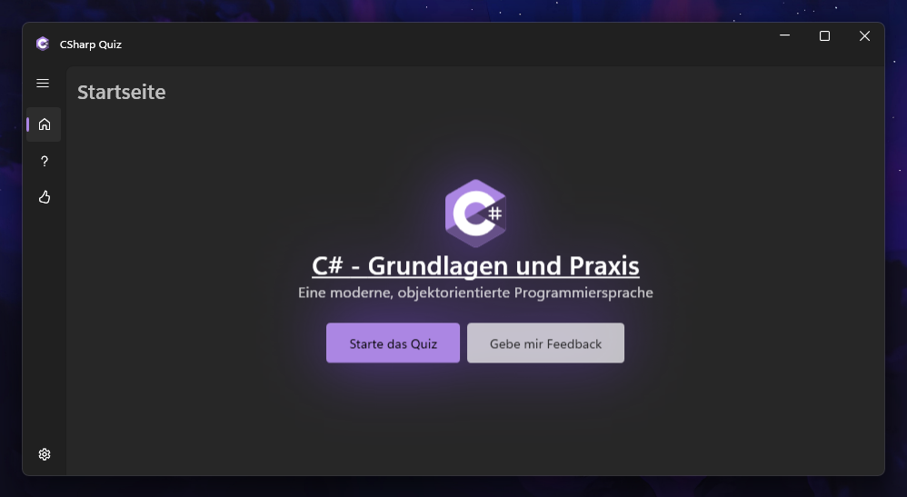
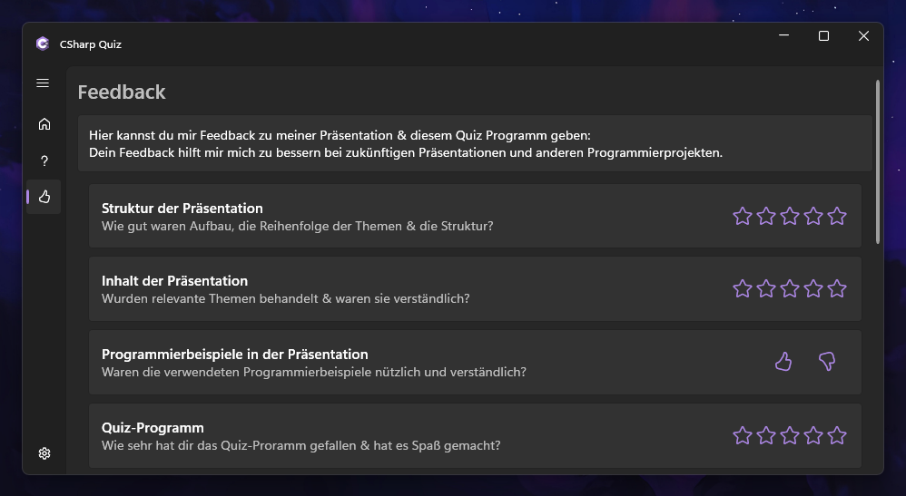
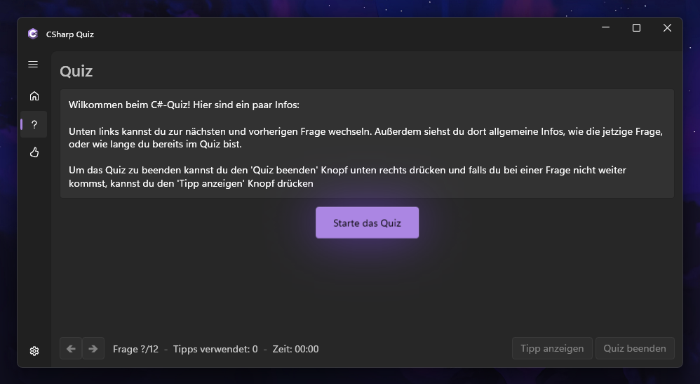
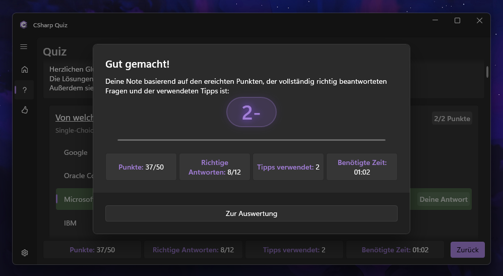
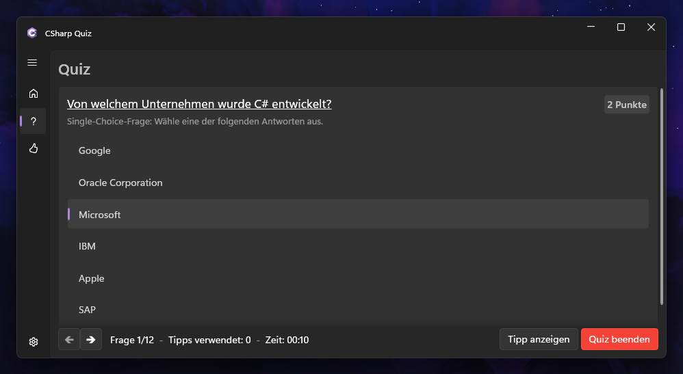
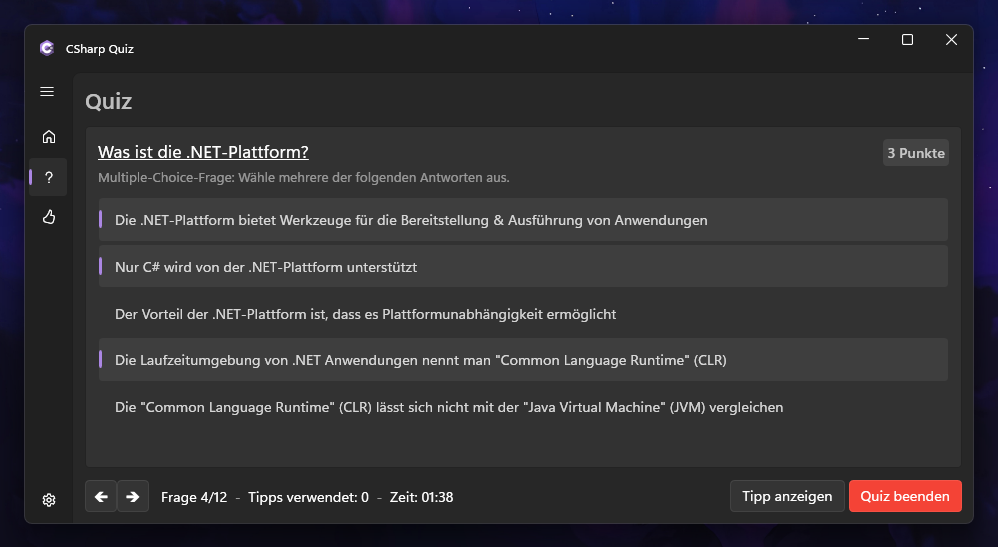
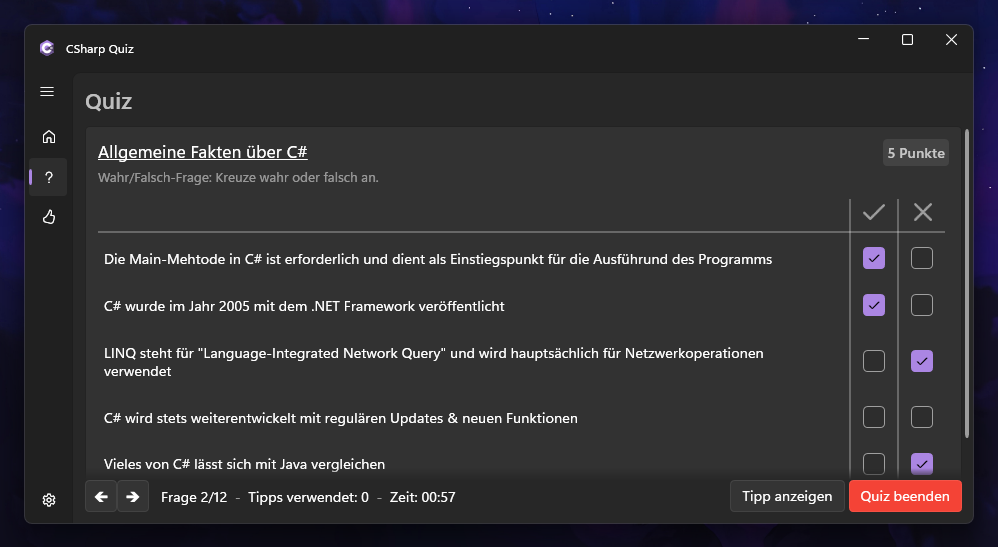
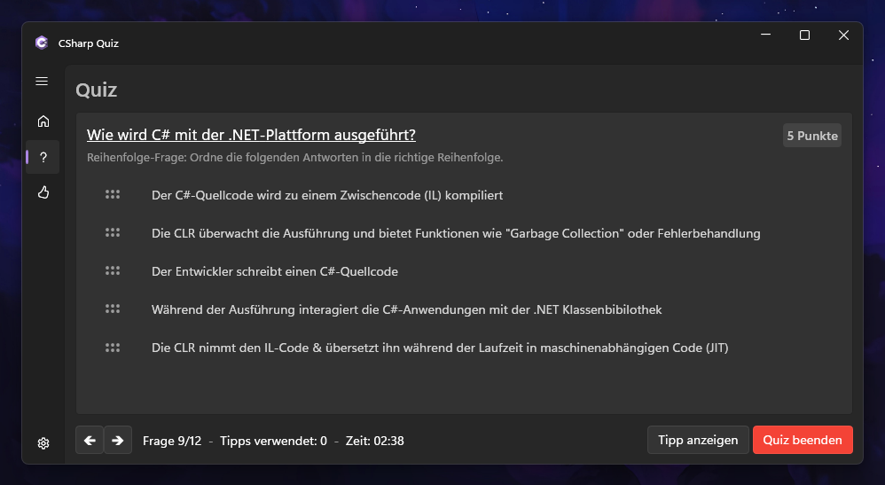
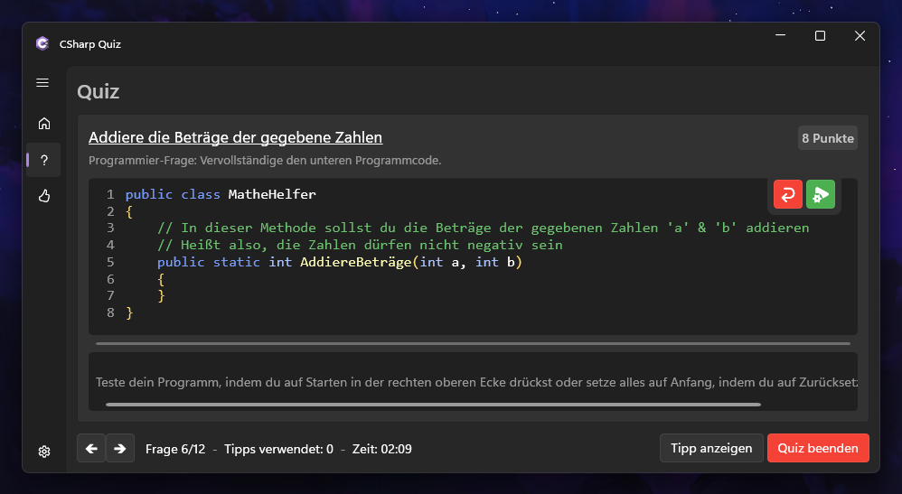

# C# Quiz-Programm
Willkommen zu meinem Quiz-Programm!

Dieses Programm wurde im Rahmen meiner Informatik-Präsentation entwickelt und bietet eine interaktive Möglichkeit, dein Wissen über C# zu testen.
Außerdem kannst du direkt im Programm Feedback zu meiner Präsentation & dem Programm geben.  

---

## Screenshots
<table>
  <tr>
    <th>Startseite</th>
    <th>Feedback</th>
    <th>Quiz (Wilkommen)</th>
    <th>Quiz (Auswertung-Übersicht)</th>
  </tr>
  <tr>
    <td></td>
    <td></td>
    <td></td>
    <td></td>
  </tr>
</table>
<table>
  <tr>
    <th>Quiz (Frage-SingleChoice)</th>
    <th>Quiz (Frage-MultipleChoice)</th>
    <th>Quiz (Frage-Wahr/Falsch)</th>
    <th>Quiz (Frage-Reihenfolge)</th>
    <th>Quiz (Aufgabe-Programmieren)</th>
  </tr>
  <tr>
    <td></td>
    <td></td>
    <td></td>
    <td></td>
    <td></td>
  </tr>
</table>

---

## Installation
1. Gehe zur [Releases-Übersicht](https://github.com/IcySnex/CSharpQuiz/releases)
2. Lade die neuste Version herunter "CSharpQuiz.win-x86.zip"
3. Entpacke die .zip-Datei
4. Starte das Programm "CSharpQuiz.exe"

---

## Programm eigenständig kompilieren
Wenn du das Quiz-Programm selber kompilieren möchtest um ein paar Änderungen vorzunehmen oder einfach nur um etwas auszuprobieren, befolge diese Anweisungen:
1. Klone die Repository: `git clone https://github.com/IcySnex/CSharpQuiz.git`
2. Öffne das Projekt "CSharpQuiz.sln" in deiner bevorzugten Entwicklungsumgebung (Visual Studio)
3. Füge deine Änderungen am Source-Code hinzu
4. Kompiliere das Programm und starte dein Quiz!

---

## Abhängigkeiten (Bibliotheken)
- [WPF-UI](https://wpfui.lepo.co/) 3.0.1: Moderne Oberfläche, basierend auf Microsoft's Fluent-UI
- [CommunityToolkit.Mvvm](https://learn.microsoft.com/en-us/dotnet/communitytoolkit/mvvm/) 8.2.2: Microsoft's Tool um MVVM-Pattern ohne viel Boiler-Plate-Code zu implementieren
- [Microsoft.Extensions.Hosting, Microsoft.Extensions.Hosting.Abstractions](https://dot.net/) 8.0.0: Infrastruktur für gehostete Anwendungen
- [Serilog, Serilog.Extensions.Hosting, Serilog.Sinks.Debug](https://serilog.net/) 3.1.1, 8.0.0, 2.0.0: Simple Logging-Infrastruktur
- [UI.SyntaxBox](https://github.com/FLindqvist/UI.SyntaxBox) 1.0.0-modifiziert: Verwendet bei "Programmier-Aufgabe" für Syntax-Highlighting
- [Microsoft.CodeAnalysis.CSharp](https://github.com/dotnet/roslyn) 4.9.2: Verwendet bei "Programmier-Aufgabe" für In-Application-Compiling
- [PixiEditor.ColorPicker](https://github.com/PixiEditor/ColorPicker) 3.4.1: Verwendet für den Farb-Auswähler für die Einstellungen
- [gong-wpf-dragdrop](https://github.com/punker76/gong-wpf-dragdrop) 3.2.1: Verwendet bei "Reihenfolge-Frage" um Drag & Drop zu vereinfachen
